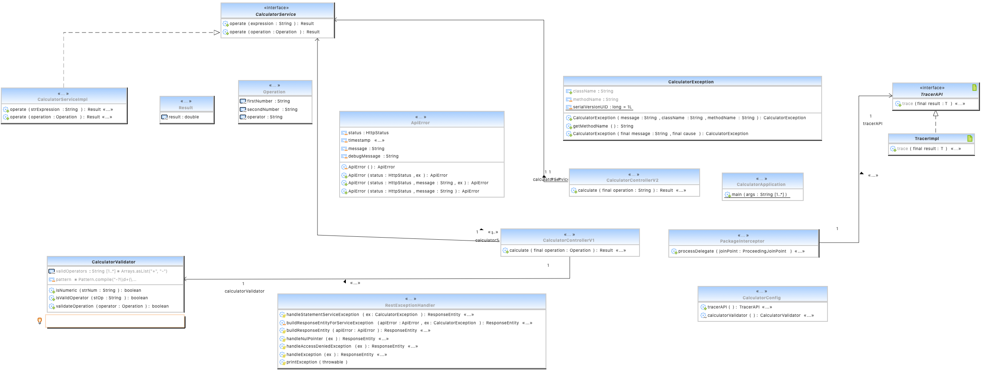

Enunciado
=================

El objetivo de este ejercicio es implementar un microservicio "calculadora", usando maven + spring-boot

Este microservicio tiene que exponer un API que debe ser capaz, a partir de unos parámetros de entrada, de realizar operaciones aritméticas. Al ser una versión POC, sólo será capaz de realizar sumas y restas de dos elementos, aunque se prevé que en futuras versiones haya otros tipos de operaciones y de mayor complejidad. También se incluye con este enunciado un jar que contiene un API de traceo de operaciones que debe ser invocado por el microservicio para tracear el resultado de la operación.

El tiempo para hacer el ejercicio es de hasta cuatro horas a partir de la recepción del correo con este ejercicio, plazo máximo en el que debe referirse una URL de github (o similares) a la dirección de acuadros@sanitas.es para su análisis. El objeto del ejercicio NO es entregar el microservicio, sino ver cómo se plantea la solución.

Notas adicionales
=================

* Lo que se busca ver es la manera en que se afronta el problema, no la solución por si misma. En este sentido, no hay una solución correcta, es mucho más interesante el histórico de Git como hilo conductor de lo que se va haciendo. Tener un único commit con todas las actuaciones efectuadas no es aconsejable.

* Se puede usar cualquier librería / versión que se considere necesaria para llevar a cabo la tarea. Los únicos requisitos son:
  * debe ser un proyecto maven (cualquier versión de maven)
  * debe ser un microservicio spring-boot (cualquier versión de spring-boot)

* El entregable debe compilar en una instalación de maven totalmente limpia, debe indicarse en un fichero README tanto los pasos necesarios para generar el jar final como para ejecutarlo (no hace falta mucho detalle).

Consideraciones
=================
* El UML inicial resultaría como sigue, con una representación de los principales componentes clásicos en una estructura de servicios REST con Spring Boot.

* Para la ejecución de operaciones con la calculadora se ha tenido en cuenta la librería EXP4J que es capaz de ejecutar operaciones aritméticas entre otras y se podrá tener en cuenta para futuras operaciones.

* Se ha incluido un Global Exception Handler como ejemplo de captura global de excepciones.

* El paquete tracer contenía un error, puesto que TracerImpl no implementaba el interfaz TracerAPI.
 * se ha incluido en el paquete io.corp.calculator.trace y se ha incluido esa consideración

* Se ha incluido un sistema rústico de versionado basado en UI con dos Controller, simulando que la implementación V2 tenga la opción de enviar una expresión en String para que sea evaluada por el motor EXP4J.

* Para la V1 se ha incluido una validación que únicamente permite operaciones de suma y resta, incluyendo esa característica con un Validador al uso en el Controller.

* Para la V2 no se ha tenido en cuenta validación, puesto que se delega en la librería. Podría mejorarse explorando las capacidades de EXP4J.

* Para la trazabilidad básica se ha incluido un interceptor AOP donde se realiza la llamada al trazador.

* Para los tests se ha incluido una suerte de Tests de Mocks de Servicio, Integración y MVC para ejemplo. Únicamente para V1.

* el JAR de Tracer debería haber sido incluido como 

         <dependency>
			<groupId>io.corp.</groupId>
			<artifactId>tracer</artifactId>
			<version>1.0.0</version>
			<scope>system</scope>
			<systemPath>${project.basedir}/src/main/resources/lib/tracer-1.0.0.jar</systemPath>
		</dependency>

Pero se ha descartado por no contar con la implementación de TracerAPI con TracerImpl

Compilación
=================
* el servicio debería compilar con maven : mvn clean package

Ejecución
=================
* el servicio debería ejecutar con : java -jar calculator-0.0.1-SNAPSHOT.jar 
 
* al arrancar en el navegador : http://localhost:8080/swagger-ui/index.html
 